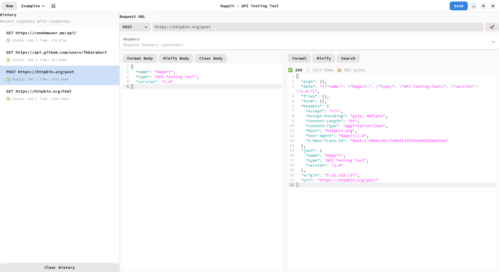

# Rappit - API Testing Tool

A modern, open-source API testing and debugging client built with Python and GTK4.

## Example Video

## Features

- 🚀 **Fast & Lightweight** - Built with performance in mind
- 🎨 **Native GTK4 UI** - Seamless desktop integration
- 📡 **Multiple Protocols** - REST, HTTP, HTTPS support
- 💾 **Request History** - Keep track of your API calls
- 🎯 **Smart Formatting** - Auto-format JSON/XML responses
- 🔍 **Search & Highlight** - Find text in responses
- ⚡ **Quick Examples** - Predefined API examples
- 🛠️ **Customizable** - Themes, fonts, and preferences
